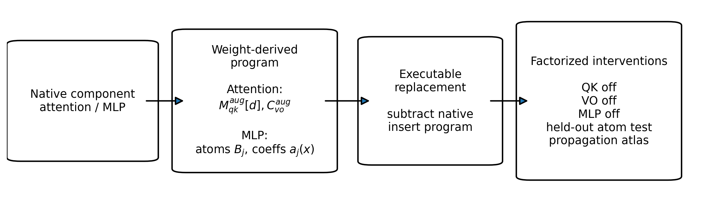
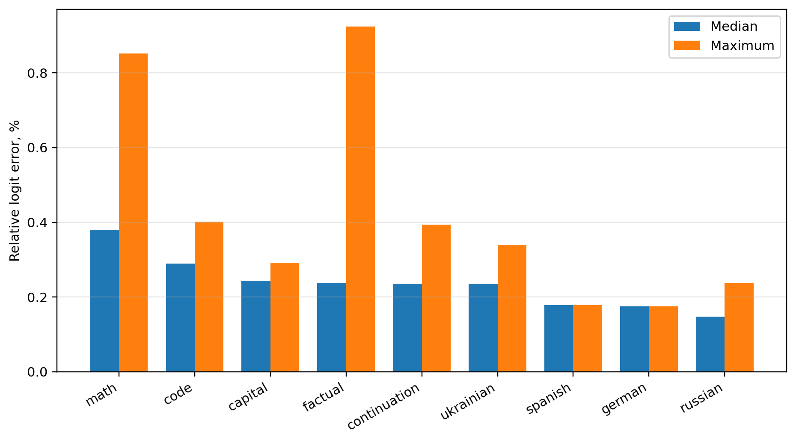
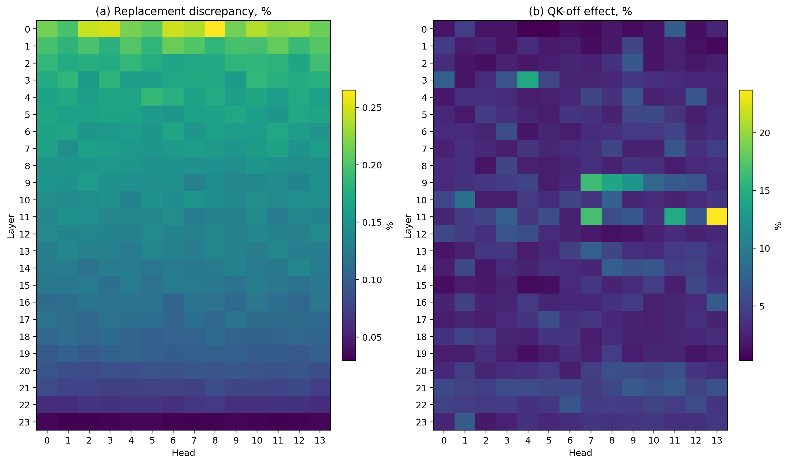
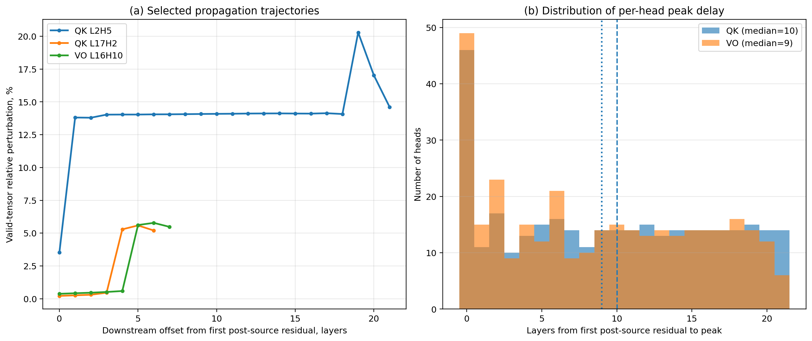

# Executable Matrix Programs: faithful weight-derived replacement and factorized intervention in pretrained transformers

**English arXiv draft v0.7**

**Author:** Maxim Vladimirovich Zhivotok  
**Affiliation:** Independent Researcher, Ukraine  
**Email:** maxwelhelp@gmail.com  
**Code and results:** https://github.com/maxwelhelp/matrix-programs

---

## Abstract

We present a method for extracting **executable component-level matrix programs** from a pretrained decoder-only transformer without retraining or modifying its weights. For RoPE attention, the method constructs a weight-derived QK routing target \(M^{\mathrm{aug}}_{qk}[d]\), indexed by relative distance, and a VO payload map \(C^{\mathrm{aug}}_{vo}\); for a SwiGLU MLP, it constructs an exact atom program with a gate/read/write factorization. Unlike input-specific locally linear representations, these structural objects are derived directly from the weights and reused across inputs. On Qwen2.5-0.5B-Instruct, we simultaneously replace all 336 attention heads and all 24 MLP sublayers with program execution inside the native forward pass. Across 64 prompts, the median relative error of the full logit vector is **0.258%**, the 95th percentile is **0.566%**, the maximum is **0.923%**, and the top-1 prediction is preserved in **100%** of cases. Using the same interface, we construct a complete factorized causal atlas: exact replacement, QK-off, and VO-off are measured separately for all 336 heads, while exact replacement and MLP-off are measured for all 24 MLPs. The median ratios of intervention effect to observed replacement discrepancy are **24.89×** for QK, **20.62×** for VO, and **152.05×** for MLPs. Downstream propagation profiles show that, for **75.0%** of QK interventions and **71.4%** of VO interventions, the peak internal effect occurs at least four layers after the source; the median delays to the peak are **10** and **9** layers, respectively. The matrix program therefore serves not only as an analytic description of a component, but as an **executable interface** for faithful replacement, factorized intervention, and analysis of distributed computation across model depth.

---

## 1. Introduction

Mechanistic interpretability seeks to recover the computational structure of a trained network: to determine which model components implement particular transformations and how these transformations jointly produce an output. Important lines of work for transformers include QK/OV circuit analysis, activation patching and causal tracing, sparse autoencoders, input-specific locally linear mappings, singular-vector decompositions of internal components, and RASP-style decompilation. A practical question nevertheless remains: can we extract from the weights of a modern language model an **explicit and executable** component program, run it again inside the original forward pass, and use it to replace not a single selected tensor but the complete attention+MLP backbone?

Modern decoder transformers make this task more difficult through implementation details including pre-normalization, RMSNorm, RoPE, GQA, q/k/v biases, causal masking, gated SwiGLU MLPs, and dtype-dependent arithmetic. Each element is individually familiar, but a faithful extractor must align all of them with the native implementation. In this work, we construct such an extractor for a Qwen2.5-style architecture and evaluate not only local reconstruction, but also **global executable replacement** inside actual inference.

### 1.1 Main contributions

1. **A unified executable, weight-derived component-program representation.** Building on the established QK/OV circuit decomposition and RoPE's relative-position formulation (Elhage et al., 2021; Su et al., 2021), we instantiate a reusable program for the modern RoPE/GQA/RMSNorm/bias/SwiGLU stack: relative-distance-indexed affine-bilinear QK targets \(M^{\mathrm{aug}}_{qk}[d]\), an affine VO map \(C^{\mathrm{aug}}_{vo}\), and an exact SwiGLU atom program that retains the native nonlinearity as input-dependent coefficients over static rank-1 atoms with a gate/read/write factorization. The contribution is the integrated executable representation and its faithful reinsertion, not novelty of the underlying QK/OV decomposition, RoPE identity, or algebraic SwiGLU expansion. Unlike input-specific Jacobian mappings (Golden, 2025), the structural objects are derived from the weights once and reused across inputs; unlike transcoders (Dunefsky et al., 2024), no surrogate model is trained.
2. **Global executable replacement.** All 336 attention heads and all 24 MLP sublayers of Qwen2.5-0.5B-Instruct are replaced by weight-derived program execution inside the native forward pass; the complete backbone preserves the top-1 prediction on all 64 prompts with a median logit error of **0.258%**.
3. **A complete factorized attention causal atlas.** For every head, we separately measure exact replacement, QK-off, VO-off, and downstream propagation, thereby separating routing from payload.
4. **A complete MLP atlas.** For all 24 MLPs, we measure exact replacement and causal removal; intervention effects are two to three orders of magnitude larger than the replacement discrepancy.
5. **Effect-to-replacement-discrepancy calibration.** Each intervention effect is normalized by the discrepancy of the same executable replacement interface—**24.89×** for QK, **20.62×** for VO, and **152.05×** for MLPs at the median. We use this as a reusable calibration practice for separating intervention effects from artifacts of the replacement implementation; it is not presented as an independent causal identification theorem.
6. **Downstream profiling.** We measure not only the final logit effect, but also the change in the residual stream after every subsequent layer, exposing delayed and preparatory components. The median delays to the peak are 10 layers for QK interventions and 9 layers for VO interventions.
7. **A verified extractor for a modern stack.** The implementation accounts for RoPE, RMSNorm, GQA, q/k/v biases, and SwiGLU and releases complete machine-readable reports. A direct control shows that folding the learned biases is empirically necessary: the no-bias QK form has a median error of **105%**, compared with **0.0526%** for the complete affine form.

Separately, we describe an **exploratory gate lens**. Because the activation of a SwiGLU unit is modulated by \(\operatorname{silu}(W_g x)\), we use the gate projection \(W_g\) as a qualitative probe of unit selectivity rather than treating the up projection \(W_u\) alone as the selector. We use this lens only in the illustrative case study in Section 6.5 and do not treat it as a validated main contribution pending a quantitative benchmark (Limitation 9).

### 1.2 Claims we do not make

We do not claim novelty for the general QK/OV decomposition, the algebraic expansion of SwiGLU, homogeneous coordinates as a mathematical device, the relative-position identity of RoPE, activation ablation in general, representing a transformer as a matrix system in general, resolving superposition, or accelerating inference. We also do not claim universal support for arbitrary architectures without an architecture adapter.

---

## 2. Architecture and notation

Consider a decoder-only transformer with residual dimension \(H\). We denote the state at position \(t\) before a layer component by \(x_t\in\mathbb{R}^{H}\).

### 2.1 RMSNorm

\[
\widetilde{x} = \operatorname{RMSNorm}_{\gamma}(x) = \frac{x}{\sqrt{\operatorname{mean}(x^2)+\varepsilon}}\odot\gamma.
\]

### 2.2 Homogeneous coordinates

For an affine projection \(z=Wx+b\), define

\[
x_{\mathrm{aug}}=\begin{bmatrix}x\\1\end{bmatrix},\qquad W_{\mathrm{aug}}=\begin{bmatrix}W & b\end{bmatrix},
\]

so that \(z=W_{\mathrm{aug}}x_{\mathrm{aug}}\). In a companion reconstruction run, the QK form with folded biases had a median error of **0.0526%**, whereas the no-bias control had an error of **105%**. For Qwen2.5, homogeneous coordinates are therefore a necessary part of the faithful circuit target rather than a cosmetic notation.

### 2.3 RoPE convention

In the implementation, tensors are stored as row vectors and RoPE is applied as \(vR_p^\top\). The formulas below use the equivalent column-vector convention. The matrix ordering is validated by direct reconstruction against the native forward pass.

---

## 3. Weight-derived component programs

### 3.1 QK: routing program

For an attention head of dimension \(D\),

\[
q_i^{\mathrm{pre}} = W_q\widetilde{x}_i+b_q,\qquad k_j^{\mathrm{pre}} = W_k\widetilde{x}_j+b_k.
\]

After RoPE,

\[
q_i=R_iq_i^{\mathrm{pre}},\qquad k_j=R_jk_j^{\mathrm{pre}}.
\]

The pre-softmax score is

\[
s_{ij}=\frac{q_i^\top k_j}{\sqrt{D}} = x_{\mathrm{aug},i}^{\top} M^{\mathrm{aug}}_{qk}[i-j] x_{\mathrm{aug},j},
\]

where

\[
M^{\mathrm{aug}}_{qk}[d] = \frac{(W_q^{\mathrm{aug}})^\top R_{\mathrm{rel}}[d] W_k^{\mathrm{aug}}}{\sqrt{D}}.
\]

At runtime, the same program can be executed in factorized form through augmented q and k vectors, without necessarily materializing a full \((H+1)\times(H+1)\) matrix for every distance.

### 3.2 VO: payload program

\[
C^{\mathrm{aug}}_{vo}=W_oW_v^{\mathrm{aug}},\qquad \operatorname{payload}_j=C^{\mathrm{aug}}_{vo}x_{\mathrm{aug},j},
\]

\[
y_i=\sum_j A_{ij}\operatorname{payload}_j.
\]

QK determines routing, whereas VO determines the transported content and its write direction.

### 3.3 SwiGLU MLP

\[
y=W_d\left[\operatorname{silu}(W_g\widetilde{x})\odot (W_u\widetilde{x})\right].
\]

Component-wise,

\[
y=\sum_{j=1}^{m} a_j(x)W_d[:,j],\qquad a_j(x)=\operatorname{silu}(W_{g,j}\widetilde{x})\cdot (W_{u,j}\widetilde{x}).
\]

We factor each neuron into gate, read, and write terms:

\[
\operatorname{gate}_j(x)=\operatorname{silu}(W_{g,j}\widetilde{x}),\quad
\operatorname{read}_j(x)=W_{u,j}\widetilde{x},\quad
\operatorname{write}_j=W_d[:,j],
\]

and define the static rank-1 atom

\[
B_j = W_d[:,j]\otimes W_u[j,:].
\]

---

## 4. Executable replacement and factorized interventions

For a selected set of attention heads \(S_L\) in layer \(L\), we compute the native contribution \(Y^{\mathrm{native}}_{S_L}\) and the program contribution \(Y^{\mathrm{program}}_{S_L}\). The attention module output is replaced by

\[
Y^{\mathrm{patched}} = Y^{\mathrm{module}} - Y^{\mathrm{native}}_{S_L} + Y^{\mathrm{program}}_{S_L}.
\]

For an MLP, the native output is replaced by

\[
Y^{\mathrm{program}}_{\mathrm{MLP}} = \sum_j a_j(x)W_d[:,j].
\]

The global experiment installs hooks on all 24 attention sublayers and all 24 MLP sublayers simultaneously, thereby replacing the complete attention+MLP backbone. Layer norms, embeddings, residual additions, and the language-model head remain native.

The interventions are defined as follows:

- **QK-off:** content-dependent QK scores for the selected head are zeroed before softmax.
- **VO-off:** the selected head's payload is zeroed while its routing computation is retained.
- **MLP-off:** the selected MLP output is zeroed.

The main exact-replacement metric is

\[
E_{\mathrm{logit}} = 100\cdot \frac{\|\ell_{\mathrm{patched}}-\ell_{\mathrm{base}}\|_2}{\|\ell_{\mathrm{base}}\|_2}.
\]

We also measure KL divergence, Jensen-Shannon divergence, logit cosine similarity, top-1 preservation, and top-5 overlap.

Throughout the paper, we use the term **replacement discrepancy**. The native identity control in the current implementation is a sanity check and is not used as an independent estimate of a numerical lower bound. Per-experiment summaries over prompts use the released `torch.median` aggregation, which returns the lower middle value for an even sample count. Medians reported across rows of the released head and MLP atlas tables use the conventional median, averaging the two middle values when the number of components is even.

---

## 5. Experimental setup

### 5.1 Model

`Qwen/Qwen2.5-0.5B-Instruct`:

- 24 layers;
- 14 attention heads per layer (336 total);
- 2 KV heads;
- residual dimension \(H=896\);
- head dimension \(D=64\);
- SwiGLU intermediate dimension \(m=4864\);
- fp16;
- eager attention.

### 5.2 Prompt suite

The suite contains 64 short next-token prompts:

- Capitals: 12
- Factual: 12
- Math: 10
- Code: 10
- Continuation: 10
- Russian: 4
- Ukrainian: 4
- German: 1
- Spanish: 1

### 5.3 Experimental scale

- 1662 main experiments;
- 106,368 experiment-prompt evaluations;
- global replacements;
- a complete 336-head atlas;
- a complete 24-MLP atlas;
- 24 layer-group profiles;
- downstream propagation profiles.

### 5.4 Reproducibility

The arXiv repository records:

- the `torch` and `transformers` versions;
- the revision of `Qwen/Qwen2.5-0.5B-Instruct`;
- the random seed;
- hardware: **Tesla P40 24GB**;
- the wall-clock time of the full run;
- exact commands;
- the SHA256 hash of the main script;
- the corrected atom-split script with independent random seeds.

---

## 6. Results

### 6.1 Companion reconstruction

| Component | Median relative error |
|---|---:|
| QK scores with RoPE+bias | 0.0526% |
| Attention probabilities | 0.0599% |
| VO head output | 0.0277% |
| MLP output | 0.0426% |
| QK without bias folding | 105% |

The no-bias control shows that, for Qwen2.5, folding biases through homogeneous coordinates is necessary rather than cosmetic.

### 6.2 Global executable replacement

| Replacement | N | Median | p95 | Max | Median KL | Top-1 |
|---|---:|---:|---:|---:|---:|---:|
| All attention | 64 | 0.254% | 0.477% | 0.885% | 3.38e-5 | 100% |
| All MLPs | 64 | 0.241% | 0.419% | 0.883% | 2.68e-5 | 100% |
| Attention + MLP | 64 | **0.258%** | **0.566%** | **0.923%** | **3.09e-5** | **100%** |

For the complete backbone, the median logit cosine similarity is **0.999990**, and the median top-5 overlap is **1.0**.



*Figure 1. Extraction of a weight-derived program, its executable replacement inside the native forward pass, and factorized interventions.*



*Figure 4. Error of global attention+MLP backbone replacement by prompt category; bars show the median and maximum within each category.*

### 6.3 Single-component executable replacement across the full model

| Object | Number of components | Median replacement discrepancy | p95 | Max | Aggregate top-1 preservation |
|---|---:|---:|---:|---:|---:|
| Attention head | 336 | 0.137% | 0.201% | 0.265% | 100% |
| MLP layer | 24 | 0.139% | 0.192% | 0.243% | 99.935% |
| Full transformer layer | 24 | 0.139% | 0.214% | 0.241% | >99.9% |

### 6.4 Complete head atlas

| Metric | QK-off | VO-off |
|---|---:|---:|
| Median logit effect | 3.280% | 2.883% |
| p95 | 6.859% | 6.664% |
| Max | 23.649% | 11.403% |
| Median effect/replacement ratio | 24.89× | 20.62× |
| Heads with ratio >10× | 92.86% | 84.23% |
| Aggregate top-1 change | 6.12% | 5.82% |
| Heads changing top-1 at least once | 96.13% | 92.56% |



*Figure 2. Complete 24×14 atlas. Left: observed replacement discrepancy for each head. Right: QK-off effect for the same head.*

### 6.5 Qualitative illustration: `"The capital of France is"`

**This section is illustrative and is not part of the main claims. The gate lens remains an exploratory tool (see Limitations).** Nevertheless, a mechanistic-interpretability paper benefits from showing how the executable interface makes a concrete computation legible.

The prompt `"The capital of France is"` produces the prediction `" Paris"`. In late layers, the extracted program exposes three levels of structure.

**Attention: which heads contribute most and where they read from.**

- **L21H6:** contribution `+1.094`; sources: `'France' (A=0.73)`, `'The' (0.15)`, `'is' (0.07)`.
- **L21H1:** contribution `+0.279`; sources: `'France' (0.41)`, `'The' (0.36)`.
- **L20H5:** contribution `+0.201`; sources: `'France' (0.52)`, `'The' (0.38)`, `'capital' (0.05)`.

This makes explicit not only the routing, but also the payload, because the transported content is given by the map \(C_{vo}^{aug}x_{\mathrm{aug},j}\).

**MLP atoms: which late-layer atoms are active and what themes they carry.**

- **L18 n3178:** `a=-18.25`; gate lens: `towns, hom`.
- **L20 n4520:** `a=-30.43`; gate lens: `city, .city, _city`.
- **L20 n3433:** `a=-9.28`; reads: `congressional, 白宫, 政府`; writes: `Washington, DC, 华盛顿`.
- **L21 n4090:** `a=+30.97`; reads: `法国, French, France`; writes: `法国, French, France`.
- **L22 n2750:** `a=-6.73`; reads: `French, Prix, 法国`; writes: `巴黎, Jean, Paris`.
- **L23 n1465:** `a=+47.10`; reads: `French, France, 法国, Paris`.

Illustratively, these atoms form a semantic chain `towns → city → France → Paris`.

**Causal verification from the earlier exploratory run.**

- **L23 n1465:** `Δlogit(real) = -8.406`; `real/random = 76.9`; `real/unrelated = 7.0`.
- **L21 n4090:** `Δlogit(real) = +0.719`; `real/random = 3.5`; `real/unrelated = 3.1`.

Because the held-out atom suite in the current archive was affected by a random-control seed bug, this example should be treated as a qualitative illustration rather than part of the central quantitative result.

### 6.6 Complete MLP atlas

| Metric | Value |
|---|---:|
| Median replacement discrepancy | 0.139% |
| Median MLP-off effect | 23.44% |
| p95 MLP-off | 81.97% |
| Max MLP-off | 99.51% |
| Median effect/replacement ratio | 152.05× |
| Aggregate top-1 change | 38.15% |

### 6.7 Layer-group interventions

| Intervention | Median logit effect | Median top-1 change rate |
|---|---:|---:|
| QK off for all heads in the layer | 13.91% | 17.19% |
| VO off for all heads in the layer | 10.05% | 18.75% |
| MLP off | 23.44% | 33.59% |
| VO + MLP off | 27.44% | 36.72% |

### 6.8 Downstream propagation and preparatory components

| Statistic | QK | VO |
|---|---:|---:|
| Median delay to peak | 10 | 9 |
| Peak delayed ≥4 layers | 75.0% | 71.4% |
| Median peak/first amplification | 17.98× | 17.19× |
| Amplification >10× | 76.2% | 73.5% |

This section and Figure 3 use the same metric, `valid_tensor_rel_percent`: the relative L2 perturbation of the complete valid residual tensor over the batch of 64 prompts. The horizontal axis in Figure 3a is aligned to the first residual state after the source head: `target_index − (source_layer + 1)`.

Preparatory examples:

- **QK L2H5:** final logits `2.10%`; first post-source residual `3.53%`; peak residual `20.29%` at target residual index `22`, i.e. `19` layers after the first post-source residual; internal/final ratio `9.64×`.
- **QK L17H2:** final logits `2.13%`; first post-source residual `0.219%`; peak residual `5.59%` at target residual index `23`, i.e. a delay of `5` layers; amplification `25.57×`.
- **VO L16H10:** final logits `2.14%`; first post-source residual `0.378%`; peak residual `5.78%` at target residual index `23`, i.e. a delay of `6` layers; amplification `15.31×`.



*Figure 3. (a) Selected propagation trajectories computed with `valid_tensor_rel_percent` and aligned to the first post-source residual. (b) Distribution of the per-head delay to the maximum valid-tensor perturbation; medians are 10 layers for QK and 9 layers for VO.*

These results support the conclusion that a weak direct final-logit effect does not imply a small computational role: many heads prepare states that are used by subsequent layers.

---

## 7. Discussion

### 7.1 The central object of the method

The central object is not an isolated matrix, but the combination

\[
\text{weight-derived structure} + \text{input-dependent execution} + \text{executable replacement} + \text{factorized intervention}.
\]

The static structures are \(M_{qk}^{aug}[d]\), \(C_{vo}^{aug}\), and \(B_j\). The dynamic quantities are hidden states, attention probabilities, and MLP coefficients.

### 7.2 Why global replacement is stronger than a local identity

An algebraic formula may be correct while an implementation is wrong about RoPE orientation, normalization placement, head layout, GQA mapping, masking, or dtype. Global replacement tests the entire chain simultaneously.

### 7.3 Comparison with activation patching

Activation patching commonly uses cached clean or corrupted activations. Here, the component value is **recomputed** from the current hidden state through a weight-derived program. This supports faithful replacement, QK-only intervention, VO-only intervention, and MLP intervention through one interface. We do not claim that activation patching is fundamentally incapable of intercepting internal Q/K/V tensors; the distinction is that our replacement is defined by an exact program representation rather than a cached counterfactual activation.

### 7.4 Preparatory components and distributed computation

Delayed downstream peaks are consistent with inter-layer communication and preparatory components. However, the propagation metric measures perturbation in the downstream graph as a whole and does not identify individual causal edges. A natural next step is to combine the program interface with path patching, path expansion, or subspace tracing.

### 7.5 Superposition

Rank-1 MLP atoms are native computational objects, but they are not necessarily monosemantic features. This work does not resolve superposition; an SAE or transcoder can be applied on top of the program representation as an additional analysis layer.

---

## 8. Related work

### 8.1 Transformer circuits

Transformer-circuit work established the language of QK/OV decomposition, read/write maps, and attention-head analysis. We extend this line to a faithful extractor for RoPE/RMSNorm/GQA/bias/SwiGLU and evaluate not only analysis but global executable replacement.

### 8.2 Locally linear mappings

Detached-Jacobian approaches, particularly Golden, construct nearly exact input-specific linear maps of a model or component. Our object differs: structural targets are derived from weights and reused across inputs, while input-dependent execution remains explicit in attention probabilities and MLP coefficients.

### 8.3 Singular-vector and component decomposition

Beyond Components studies singular directions and subfunctions within attention and MLP components. Our factorization does not compete with SVD as a method for finding subspaces; it defines a native executable representation on top of which SVD can be applied.

### 8.4 Activation patching and causal tracing

Activation patching and causal tracing localize causally important components by replacing activations from other runs or with synthetic values. We follow the same interventional logic, but replace the component not with a cached activation, but with a value recomputed through the weight-derived program on the current hidden state.

### 8.5 Causal scrubbing

Causal scrubbing tests interpretability hypotheses by replacing intermediate values with resampled values consistent with the hypothesis. Our work is related in spirit to mechanism replacement, but the replacement object differs: rather than hypothesis-driven resampling, we use the component's exact weight-derived program. This gives a narrower but stricter objective: faithful replacement and factorized intervention for native component computation.

### 8.6 Sparse autoencoders and transcoders

SAEs construct a learned feature basis over activations. Transcoders train a sparse surrogate for a component, most commonly an MLP, to approximate its input-output mapping and facilitate circuit analysis. Our approach does not train a surrogate or take optimization steps: the program is extracted directly from the weights and achieves a median replacement discrepancy of **0.139%** across all 24 MLPs without training.

### 8.7 Talking Heads and inter-layer communication

Work on inter-layer communication studies low-rank channels through which information is passed between layers and heads. Our complete atlas supports the prevalence of delayed downstream effects, but does not isolate specific communication subspaces.

### 8.8 RASP decompilation and white-box models

RASP decompilation extracts symbolic programs from small algorithmic transformers. White-box architectures construct new interpretable models. We instead analyze a pretrained language model and construct a matrix, rather than symbolic, program for its native components.

---

## 9. Limitations

1. Only one model, Qwen2.5-0.5B-Instruct, was evaluated.
2. The prompt suite contains 64 short next-token prompts rather than a large benchmark.
3. We do not report corpus-level perplexity or loss.
4. We do not evaluate long contexts or large RoPE distances.
5. The program path uses float32 for part of the computation, whereas the native model runs in fp16.
6. The native identity control for attention is a sanity check rather than an independent estimate of a numerical lower bound.
7. Propagation measures downstream perturbation, but not individual causal edges.
8. The held-out atom experiment is not part of the main claims: in the original run, three random controls were duplicated because of a seed bug; the corrected code is released separately.
9. The gate lens remains exploratory and is used only for the qualitative illustration.
10. We make no claim of inference speedup.

---

## 10. Conclusion

We presented an executable component-level representation of a pretrained Qwen2.5 transformer. All attention and MLP computations were replaced by weight-derived program execution with a median logit error of **0.258%** and **100%** top-1 preservation across 64 prompts. The complete head atlas showed that QK and VO interventions produce effects tens of times larger than the replacement discrepancy, while MLP interventions produce effects more than one hundred times larger. Downstream profiles showed that most head effects peak many layers after the source. A component matrix program is therefore not only a way to rewrite a formula, but a practical executable interface for faithful replacement, factorized intervention, and analysis of distributed computation across model depth.

---

## Appendix A. Figure generation

Figures are generated automatically from the result CSV files with

```bash
python generate_matrix_program_figures_v06_1_fixed.py \
  --results-dir outputs/qwen_matrix_program_final_article_v4/final_article \
  --out-dir figures_v06_1_fixed
```

The script creates vector PDF and PNG files:

- `fig1_method_overview.pdf`
- `fig2_head_heatmaps.pdf`
- `fig3_propagation_profiles.pdf`
- `fig4_global_replacement_by_suite.pdf`

## Appendix B. Reproducibility

The minimal GitHub artifact set is:

- the main extractor and patching script;
- the corrected atom-split script with independent random seeds;
- a `README.md` with the exact run command;
- `all_experiment_summaries.csv`;
- `all_prompt_metrics.csv`;
- `head_causal_atlas.csv`;
- `mlp_causal_atlas.csv`;
- `layer_group_atlas.csv`;
- `propagation_profiles.csv`;
- `experiment_manifest.json`;
- `final_prompts.json`;
- environment versions and a hardware note.

---

## References

[1] Elhage, N., Nanda, N., Olsson, C., et al. *A Mathematical Framework for Transformer Circuits*. Transformer Circuits Thread, 2021.

[2] Golden, J. R. *Equivalent Linear Mappings of Large Language Models*. arXiv:2505.24293, 2025.

[3] Ahmad, A., Joshi, A., Modi, A. *Beyond Components: Singular Vector-Based Interpretability of Transformer Circuits*. arXiv:2511.20273, 2025.

[4] Heimersheim, S., Nanda, N. *How to Use and Interpret Activation Patching*. arXiv:2404.15255, 2024.

[5] Zhang, F., Nanda, N. *Towards Best Practices of Activation Patching in Language Models: Metrics and Methods*. arXiv:2309.16042, 2023.

[6] Chan, L., Garriga-Alonso, A., Goldowsky-Dill, N., et al. *Causal Scrubbing: a method for rigorously testing interpretability hypotheses*. AI Alignment Forum / Redwood Research, 2022.

[7] Geiger, A., Ibeling, D., Zur, A., et al. *Causal Abstraction: A Theoretical Foundation for Mechanistic Interpretability*. arXiv:2301.04709, 2023/2025.

[8] Bricken, T., Templeton, A., Batson, J., et al. *Towards Monosemanticity: Decomposing Language Models With Dictionary Learning*. Transformer Circuits Thread, 2023.

[9] Dunefsky, J., Chlenski, P., Nanda, N. *Transcoders Find Interpretable LLM Feature Circuits*. arXiv:2406.11944, 2024.

[10] Merullo, J., Eickhoff, C., Pavlick, E. *Talking Heads: Understanding Inter-layer Communication in Transformer Language Models*. arXiv:2406.09519, 2024.

[11] Huang, X., Bakalova, A., Bhattamishra, S., Merrill, W., Hahn, M. *Discovering Interpretable Algorithms by Decompiling Transformers to RASP*. arXiv:2602.08857, 2026.

[12] Yu, Y., Buchanan, S., Pai, D., et al. *White-Box Transformers via Sparse Rate Reduction*. arXiv:2306.01129, 2023.

[13] Su, J., Lu, Y., Pan, S., et al. *RoFormer: Enhanced Transformer with Rotary Position Embedding*. arXiv:2104.09864, 2021.

[14] Shazeer, N. *GLU Variants Improve Transformer*. arXiv:2002.05202, 2020.

[15] Qwen Team. *Qwen2.5 Technical Report*. arXiv:2412.15115, 2024.
